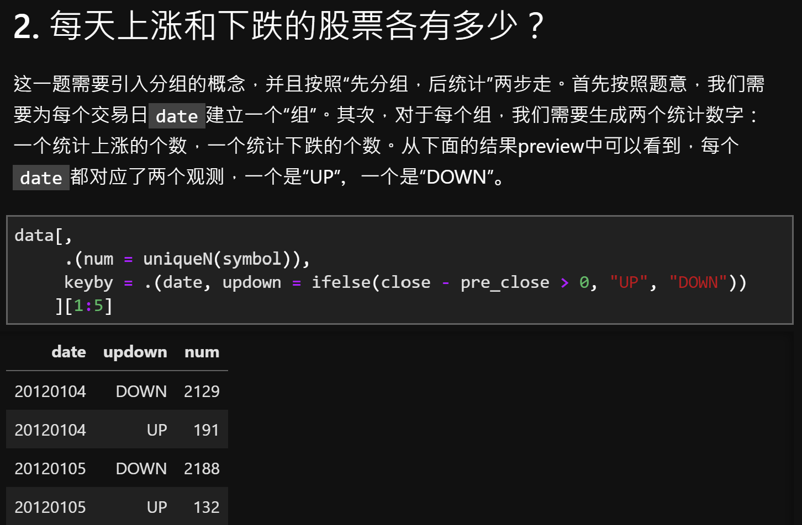

# Answer Keys to [Renkun](https://github.com/renkun-ken)'s R Data Practise
## Overview
This is the keys to [Renkun](https://github.com/renkun-ken)'s [50 R data exercises](https://github.com/renkun-ken/r-data-practice). The original 50 exercises are desiged to help users build a solid skill set for data cleaning/manipulation. [Renkun]((https://github.com/renkun-ken)) didn't provide keys to these exercises and here we present ours using the `data.table` package. We believe `data.table` is the BEST R tool for data manipulation. For more information about how amazing `data.table` is, please refer to its [Github page](https://github.com/Rdatatable/data.table). 

The 50 exercises are built on a stock price dataset including variables like `symbol`, `date` and `price`. These exercises include common data manipulation practise like *compute the average for the largest N observations within each group* or *find out the top N stocks with the largest price jump during the past M days*. 

## Project Structure
- `dataset-and-questions.md`: Introduction to the dataset and question list (no answer keys included).

- `answer-keys.ipynb`: The questions and answers.

    

- `data`: the data folder
    - `stock-market-data.rds`: the dataset. Please use `readRDS` to import the data.

# R语言数据操作练习
> Update (Feb 14, 2020)
>
> **习题30-35完成校对**。

> Update (Feb 13, 2020)
>
> **习题22-29完成校对**。对Ex-16进行了修改。

> Update (Feb 11, 2020)
>
> 增加了使用`dpylr`解题的版本（`answer-keys-dplyr.R`），由 @香酥奶油饼 提供，感谢！

> Update (Jan 7, 2020)
>
>**习题1-21完成校对**。Ex-6可能仍存在争议。 

> Update (Dec 27, 2019, First Release)
> 
> 目前有些题目的答案还不是很完善，我们正在努力校对。**经过校对并且提供答案解析的为1-35题**。

## 概览
本Repo是[Renkun](https://github.com/renkun-ken)50道R数据操作练习题的答案。这些题目旨在帮助用户掌握常见的数据操作，例如*找出每组中最大的N个观测*。这些练习依赖于一个股票价格数据集（包含在本项目中），包含日期、股票代码、价格等变量。

[Renkun](https://github.com/renkun-ken)本人没有练习的答案，我们在这里提供了使用`data.table`的实现。我们认为`data.table`是最好的R数据处理工具包，关于更多`data.table`的神奇之处，请参考它的[Github 主页](https://github.com/Rdatatable/data.table)

**所有练习及答案解析都放在[answer-keys](answer-keys.ipynb)这个Jupyter Notebook中。**

> 如果希望了解更多R相关的技巧，欢迎订阅我们的公众号：`大猫的R语言课堂`。

## 项目结构
- `dataset-and-questions.md`： 关于数据集的介绍，同时给出所有50道练习题（不含答案）。

- `answer-keys.ipynb`: 练习题答案。每一道练习题都包括题目、答案代码以及答案预览

    

## 习题预览

1. 哪些股票的代码中包含 8 这个数字？
2. 每天上涨和下跌的股票各有多少？
3. 每天每个交易所上涨、下跌的股票各有多少？
4. 沪深300成分股中，每天上涨、下跌的股票各有多少？
5. 每天每个行业各有多少只股票？
6. 股票数最大的行业和总成交额最大的行业是否总是同一个行业？
7. 每天涨幅超过5%、跌幅超过5%的股票各有多少？
8. 每天涨幅前10的股票的总成交额和跌幅前10的股票的总成交额比例是多少？
9. 每天开盘涨停的股票与收盘涨停的股票各有多少？（涨停按照收益率超过1.5%的标准计算）
10. 每天统计最近3天出现过开盘涨停、跌停的股票各有多少只？
11. 股票每天的成交额变化率和收益率的相关性如何？
12. 每天每个行业的总成交额变化率和行业收益率的相关性如何？
13. 每天市场的总成交额变化率和市场收益率相关性如何？
14. 每天市场的总成交额的变化率和所有股票收益率的标准差相关性如何？
15. 每天每个行业的总成交额变化率和行业内股票收益率的标准差相关性如何？
16. 上证50、沪深300、中证500指数成分股中，沪股和深股各有多少？
17. 上证50、沪深300、中证500指数成分股中，行业分布如何？
18. 每天上证50、沪深300、中证500指数成分股的总成交额各是多少？
19. 上证50、沪深300、中证500指数日收益率的历史波动率是多少？
20. 上证50、沪深300、中证500指数日收益率的相关系数矩阵？
21. 上证50、沪深300、去除上证50的沪深300指数日收益率的相关系数矩阵？
22. 每天沪深300指数成分占比最大的10只股票是哪些？
23. 各个行业的平均每日股票数量从大到小排序是什么？
24. 每个行业每天成交额最大的一只股票代码是什么？
25. 每个行业每天最大成交额是最小成交额的几倍？
26. 每个行业每天成交额最大的5只股票和成交额总和是多少？
27. 每个行业每天成交额超过该行业中股票成交额80%分位数的股票的平均收益率是多少？
28. 每天成交额最大的10%的股票的平均收益率和成交额最小的10%的股票的平均收益率的相关系数是多少？
29. 每天哪些行业的平均成交额高于全市场平均成交额？
30. 每天每个股票对市场的超额收益率是多少？
31. 每天每个股票对市场去除自身的超额收益率是多少？
32. 每天每个股票对行业的超额收益率是多少？
33. 每天每个股票对行业去除自身的超额收益率是多少？
34. 每个股票每天对市场的超额收益率与对行业的超额收益率的相关系数如何？
35. 每天有哪些行业的平均收益率超过市场平均收益率？
36. 每天每个行业对市场的超额收益率是多少？
37. 每天每个行业对去除本行业后的市场超额收益是多少？
38. 每天分别有多少股票是最近连续3个交易日上涨、下跌的？
39. 每天分别有多少股票是最近连续3个交易日收益率超过当天市场平均收益率？
40. 每天分别有多少股票是最新5个交易日中至少有4个交易日的收益率超过当天市场平均收益率？
41. 每个月中，个股月收益超过市场月收益1倍以上的股票有哪些？
42. 每个月中，个股月收益超过行业月收益1倍以上的股票有哪些？
43. 每个股票的收益率对市场收益率的相关系数最高的10个股票是哪些？
44. 每个行业日收益率的历史波动率是多少？（用日收益率计算标准差）
45. 各个行业的日收益率的相关系数矩阵如何？哪两个行业相关性最高、最低？
46. 各个行业的收益率对市场收益率的相关系数由高到低排列如何？
47. 每个月总成交额比上个月下降幅度最大的行业是哪个？
48. 数据当中各个股票的最大回撤幅度是多少？（最大回撤是从一个高点到低点的降幅的最大值）
49. 每只股票的胜率是多少？（胜率是每天收益率为正数的概率）
50. 每只股票的盈亏比是多少？（盈亏比是正收益之和与负收益之和的比值的绝对值）
51. 市场的胜率是多少？（市场收益率为正的概率）
52. 市场的盈亏比是多少？（市场中每个股票的市值加权正收益和市值加权负收益之比）
53. 每个行业的胜率是多少？
54. 每个行业的盈亏比是多少？（行业盈亏比是行业内每个股票的市值加权的正收益率和市值加权的负收益率之比）
55. 是否存在股票的月成交额超过所在行业当月中某天一天总成交额的情况？
56. 每天每个行业编入、编出的股票各有多少？
57. 每天每个行业内股票收益率的标准差是多少？
58. 每天每个行业内股票收益率的标准差的相关性如何？
59. 每天计算出成交额的 z-score （减去均值除以标准差）, 该指标能解释下一天个股超额收益率的多少比例？
60. 每个股票的收益率和300、500指数收益率可以回归出一个截距项和2个beta，这两个beta的分布如何？
61. 每天开盘后到最高价涨幅最大的100只股票同样也是全天(昨收到今收)涨幅最大的100只股票的比例是多少?
62. 每天计算最近三天每天对市场的超额收益率都排进当天前100的股票有哪些?
63. 每天计算最近三天每天对行业的超额收益率都排进当天行业前30%的股票有哪些?

## 学习资源推荐

* [Base R cheatsheet](http://github.com/rstudio/cheatsheets/raw/master/base-r.pdf)
* [RStudio IDE cheatsheet](https://github.com/rstudio/cheatsheets/raw/master/rstudio-ide.pdf)
* [Regular Expressions](https://www.rstudio.com/wp-content/uploads/2016/09/RegExCheatsheet.pdf)
* [Work with Strings cheatsheet](https://github.com/rstudio/cheatsheets/raw/master/strings.pdf)
* [data.table cheatsheet](https://github.com/rstudio/cheatsheets/raw/master/datatable.pdf)

## 致谢
[@frankzhangsyd](https://github.com/frankzhangsyd)

@香酥奶油饼（微信）
